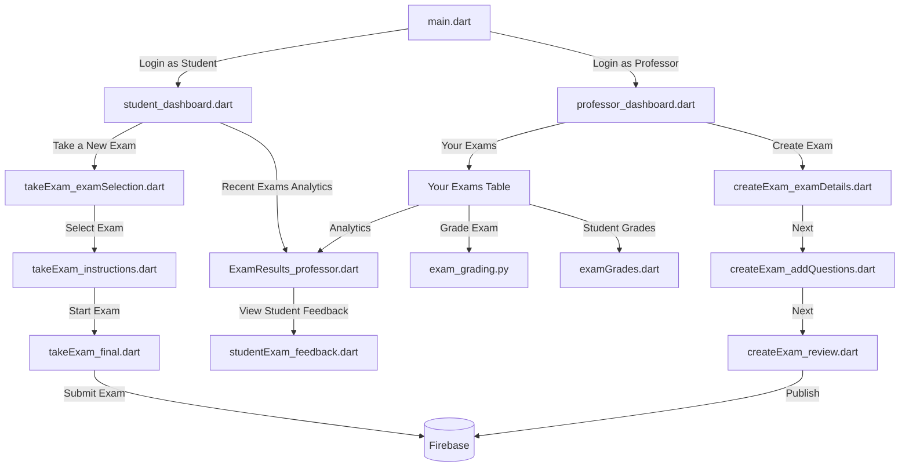

# Exam Ai: An AI-powered Grading Platform

Welcome to [**Exam Ai**](https://examai.ai) ([https://examai.ai](https://examai.ai)), an innovative AI-powered grading platform designed to revolutionize how exams and assignments are graded. Our goal is to provide a seamless experience for professors and students, ensuring efficient, accurate, and fair grading. Below, you'll find an in-depth explanation of the project, suitable for both Angel Investors and technical enthusiasts.

## Overview

Exam Ai is an enterprise platform that enables users to log in as professors or students. Here’s a brief summary of what each role can do:

### For Professors:
- **Create Exams**: Add questions, rubrics, and weights per question.
- **Automated Grading**: AI grades according to the professor’s rubrics, ensuring adherence to the desired grading criteria.
- **Detailed Feedback**: Each question receives specific feedback, helping students understand their performance.
- **Grading Control**: Professors decide when exams are graded, capturing only the latest submission by default.
- **Analytics Portal**: View class averages, grade distributions, and insights into the hardest and easiest questions.
- **Versatile Applications**: The platform can be used to create and automate homework, quizzes, exams, forms, or even interviews!

### For Students:
- **Simple Portal**: Take exams with various question types (short answers, essays, programming challenges, etc.).
- **Automated Feedback**: Receive detailed feedback on each question after grading.
- **Performance Analytics**: Access analytics to see performance trends and areas for improvement.

## Technology Stack

### Frontend:
- **Flutter**: The platform is built using Flutter as a WebApp, providing a seamless and responsive user experience.

### AI Component:
- **Gemini 1.5 PRO**: Utilizes prompt engineering to automate grading based on loaded questions, rubrics, and student answers, providing detailed feedback.

### Backend:
- **Firebase Firestore**: Manages the database and user authentication.
- **Firebase Login**: Handles secure user logins.
- **GitHub Actions**: Minimal backend setup, using a webhook and a Python script to handle grading requests and update the database.

### Security:
- **Database Rules**: Ensures that only authenticated users can push data, limiting access to documents associated with their email ID.

## Flowchart of the App Structure

Below is a flowchart that visualizes how the screens connect with each other:

## Future Vision

With your support, we aim to secure funding for the continued use of Gemini and Firebase, keeping the platform free for professors worldwide. This will help bring high standards of education to regions that cannot afford teaching assistants for grading extensive homework and quizzes.

Thank you for your interest in Exam Ai. Together, we can enhance the educational experience for both professors and students globally. 

Please visit our ([ExamAi Landing Page](https://examai.framer.website/)) for more information about or project.